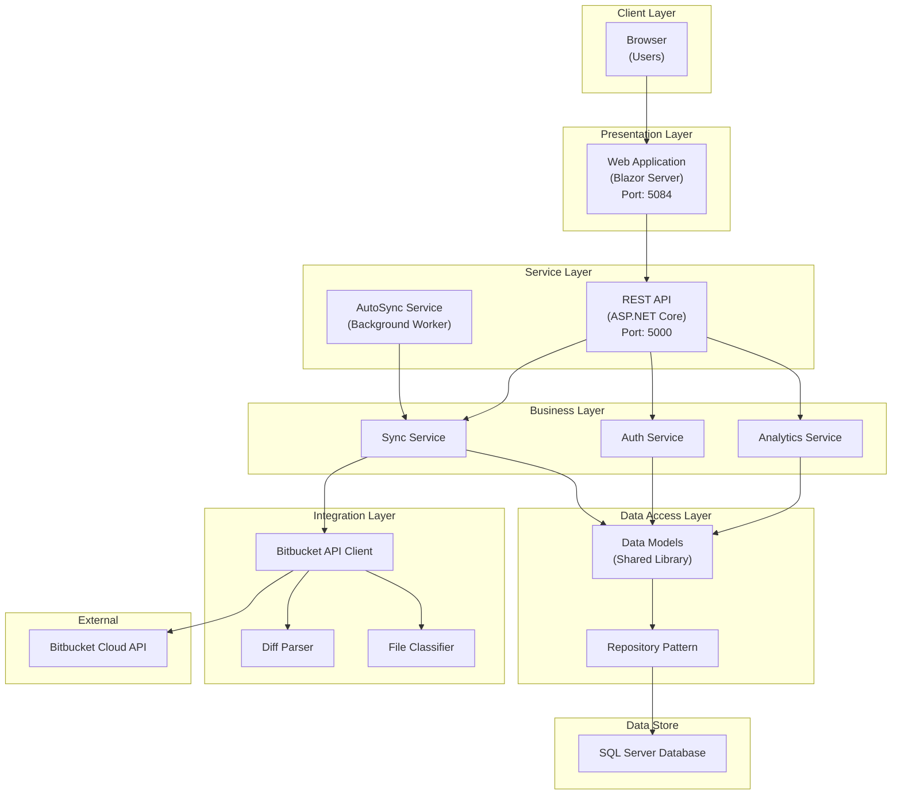

# DevView - Bitbucket Analytics Dashboard

[](https://opensource.org/licenses/MIT)
[](https://dotnet.microsoft.com/download/dotnet/9.0)
[](https://dotnet.microsoft.com/apps/aspnet/web-apps/blazor)

DevView is a comprehensive .NET 9 solution for analyzing Bitbucket repositories with real-time analytics, beautiful visualizations, and GitHub-style insights. It provides team managers and developers with deep insights into their development workflows, code contributions, and pull request patterns.

## 🌟 Key Features

### 📊 Analytics & Dashboards
- **Main Dashboard**: Organization-wide analytics with commit trends and contributor activity
- **User Dashboard**: Individual developer metrics, commit patterns, and productivity insights
- **Team Analytics**: Team-based performance metrics and collaboration patterns
- **Top Committers**: Leaderboard showing most active contributors with detailed statistics
- **PR Dashboard**: Pull request analytics including merge times, review patterns, and bottlenecks
- **Commit Punchcard**: Visual heatmap showing when commits are made (day/hour patterns)

### 📈 Data Visualization
- **Interactive Charts**: Multi-dataset area charts using Chart.js
- **Contributor Activity**: GitHub-style contribution graphs for individuals and teams
- **File Type Analysis**: Breakdown of changes by file types (code, data, config)
- **Date Range Filtering**: Flexible date selection with quick presets (7, 30, 90 days, all time)
- **Repository Filtering**: Analyze specific repositories or all repositories
- **Real-time Updates**: Live chart updates when changing filters

### 🔐 Authentication & Security
- **JWT Authentication**: Secure token-based authentication system
- **Role-Based Access Control**: Three-tier role system:
  - **Admin**: Full system access, user management, all settings
  - **Manager**: Team management, elevated analytics access
  - **User**: Standard access to dashboards and personal analytics
- **Password Management**: Secure password hashing with salt
- **Session Management**: Automatic token refresh and logout

### 🔄 Data Synchronization
- **AutoSync Service**: Background service for automated data synchronization
- **Sync Modes**:
  - **Full Sync**: Complete historical data import in configurable batches
  - **Delta Sync**: Incremental updates for recent changes
- **Selective Sync**: Choose what to sync (users, repositories, commits, PRs)
- **Smart Caching**: Avoids re-syncing already processed data
- **Rate Limiting**: Respects Bitbucket API rate limits

### 🎯 Advanced Features
- **Exclude Flags**: Mark users/repositories to exclude from reports
- **Team Management**: Create and manage development teams
- **Commit File Analysis**: Detailed view of files changed in each commit
- **PR Age Analysis**: Identify long-running pull requests
- **Code Classification**: Automatic categorization of file changes
- **Export Capabilities**: Export data for external analysis

## 🏗️ Architecture



## 📁 Project Structure

```
DevView/
├── 📊 API/                          # REST API Service
│   ├── Endpoints/
│   │   ├── Analytics/               # Analytics endpoints
│   │   ├── Auth/                    # Authentication & authorization
│   │   ├── Commits/                 # Commit data endpoints
│   │   ├── PullRequests/            # PR management
│   │   ├── Sync/                    # Manual sync triggers
│   │   └── Teams/                   # Team management
│   ├── Services/                    # Business logic
│   ├── SqlSchema/                   # Database scripts
│   └── appsettings.json            # API configuration
│
├── 🌐 Web/                          # Blazor Server Application
│   ├── Components/
│   │   ├── Pages/                   # Main pages
│   │   │   ├── Dashboard.razor      # Main analytics
│   │   │   ├── UserDashboard.razor  # User metrics
│   │   │   ├── Commits.razor        # Commit browser
│   │   │   ├── PullRequests.razor   # PR browser
│   │   │   ├── TopCommitters.razor  # Leaderboard
│   │   │   ├── PrDashboard.razor    # PR analytics
│   │   │   ├── Teams.razor          # Team management
│   │   │   └── Login.razor          # Authentication
│   │   ├── Common/                  # Shared components
│   │   │   ├── CommitsFilter.razor  # Advanced filtering
│   │   │   ├── CommitActivityChart.razor
│   │   │   ├── CommitPunchcardChart.razor
│   │   │   └── ContributorChart.razor
│   │   └── Layout/                  # Layout components
│   ├── Services/                    # Frontend services
│   │   ├── AuthService.cs          # Auth management
│   │   ├── JwtAuthStateProvider.cs # JWT handling
│   │   └── WorkspaceService.cs     # Workspace state
│   └── wwwroot/                     # Static assets
│       ├── js/                      # JavaScript files
│       └── lib/                     # Libraries (Chart.js, Bootstrap)
│
├── 🔄 AutoSync/                     # Background Sync Service
│   ├── Program.cs                   # Main sync logic
│   └── appsettings.json            # Sync configuration
│
├── 💾 Data/                         # Shared Data Layer
│   ├── Models/                      # Entity models
│   │   ├── Commit.cs
│   │   ├── CommitFile.cs
│   │   ├── PullRequest.cs
│   │   ├── Team.cs
│   │   └── SyncSettings.cs
│   └── Services/                    # Data repositories
│
├── 🔌 Integration/                  # External Integration
│   ├── Common/                      # Shared integration code
│   │   └── BitbucketApiClient.cs   # API client
│   ├── Commits/                     # Commit sync
│   ├── PullRequests/               # PR sync
│   ├── Repositories/               # Repo management
│   ├── Users/                      # User sync
│   └── Utils/                      # Utilities
│       ├── DiffParserService.cs    # Parse diffs
│       └── FileClassificationService.cs
│
└── 📦 Entities/                     # DTOs & Contracts
    └── DTOs/                        # Data transfer objects
```

## 🚀 Quick Start (Local Development)

### Prerequisites
- [.NET 9 SDK](https://dotnet.microsoft.com/download/dotnet/9.0)
- [SQL Server](https://www.microsoft.com/sql-server) or SQL Server Express
- [Git](https://git-scm.com/)
- Bitbucket account with API access

### 1. Clone Repository
```bash
git clone https://github.com/bhardwajvicky/DevView.git
cd DevView
```

### 2. Setup Configuration
```bash
# Run the configuration setup script
./setup-config.sh
```

This script will:
- Copy template configuration files
- Guide you through setting up sensitive values
- Make startup scripts executable

### 3. Database Setup

1. **Create Database**:
```sql
CREATE DATABASE DevView;
```

2. **Run Schema Scripts** (in order):
   - `API/SqlSchema/schema.sql` - Base schema
   - `API/SqlSchema/alter-auth.sql` - Authentication tables
   - `API/SqlSchema/seed-auth.sql` - Default users

3. **Update Connection String** in `API/appsettings.json`:
```json
{
  "ConnectionStrings": {
    "DefaultConnection": "Server=localhost;Database=DevView;User Id=sa;Password=YourPassword;TrustServerCertificate=True;"
  }
}
```

### 4. Configure Bitbucket Integration

1. Go to Bitbucket Settings → OAuth consumers
2. Create a new consumer with these permissions:
   - Account: Read
   - Repositories: Read
   - Pull requests: Read
3. Add credentials to `API/appsettings.json`:
```json
{
  "Bitbucket": {
    "ConsumerKey": "your-key",
    "ConsumerSecret": "your-secret"
  }
}
```

### 5. Start Services
```bash
# Use the automated startup script
./start-dev.sh

# Or manually:
# Terminal 1 - API
cd API && dotnet run

# Terminal 2 - Web
cd Web && dotnet run

# Terminal 3 - AutoSync (optional)
cd AutoSync && dotnet run
```

### 6. Access Application
- **Dashboard**: http://localhost:5084
- **Login**: Username: `admin`, Password: `Admin#12345!`
- **API Docs**: http://localhost:5000/swagger

## ☁️ Azure Deployment

### Create Resources
```bash
# Variables
RESOURCE_GROUP="rg-devview"
LOCATION="eastus"
APP_NAME="devview-app"
API_NAME="devview-api"
SQL_SERVER="devview-sql"
SQL_DATABASE="devview-db"

# Create Resource Group
az group create --name $RESOURCE_GROUP --location $LOCATION

# Create App Service Plan
az appservice plan create \
  --name asp-devview \
  --resource-group $RESOURCE_GROUP \
  --sku B1

# Create SQL Database
az sql server create \
  --name $SQL_SERVER \
  --resource-group $RESOURCE_GROUP \
  --admin-user sqladmin \
  --admin-password "SecurePassword123!"

az sql db create \
  --name $SQL_DATABASE \
  --server $SQL_SERVER \
  --resource-group $RESOURCE_GROUP \
  --service-objective S0

# Create Web Apps
az webapp create \
  --name $API_NAME \
  --resource-group $RESOURCE_GROUP \
  --plan asp-devview \
  --runtime "DOTNET:9.0"

az webapp create \
  --name $APP_NAME \
  --resource-group $RESOURCE_GROUP \
  --plan asp-devview \
  --runtime "DOTNET:9.0"
```

### Configure App Settings

For the API service:
```bash
az webapp config appsettings set \
  --name $API_NAME \
  --resource-group $RESOURCE_GROUP \
  --settings \
    ConnectionStrings__DefaultConnection="Server=tcp:devview-sql.database.windows.net,1433;Database=devview-db;User ID=sqladmin;Password=SecurePassword123!;Encrypt=True;TrustServerCertificate=False;" \
    Bitbucket__ConsumerKey="your-key" \
    Bitbucket__ConsumerSecret="your-secret" \
    Jwt__Key="your-32-character-secret-key" \
    Jwt__Issuer="devview-api" \
    Jwt__Audience="devview-api"
```

For the Web application:
```bash
az webapp config appsettings set \
  --name $APP_NAME \
  --resource-group $RESOURCE_GROUP \
  --settings \
    ApiBaseUrl="https://$API_NAME.azurewebsites.net"
```

### Deploy Applications

```bash
# Deploy API
cd API
dotnet publish -c Release -o ./publish
cd publish && zip -r ../../api.zip . && cd ../..
az webapp deploy --name $API_NAME --resource-group $RESOURCE_GROUP --src-path api.zip

# Deploy Web
cd Web
dotnet publish -c Release -o ./publish
cd publish && zip -r ../../web.zip . && cd ../..
az webapp deploy --name $APP_NAME --resource-group $RESOURCE_GROUP --src-path web.zip
```

## 📊 Features Deep Dive

### Date Range Handling
DevView includes sophisticated date handling to ensure accurate data analysis:
- **Inclusive End Dates**: When selecting an end date, the system includes the entire day (up to 23:59:59)
- **Smart Date Adjustment**: Automatically adjusts dates for API calls to prevent data loss
- **Quick Date Ranges**: Preset options for common analysis periods

### Team Management
- Create custom teams to group developers
- Analyze team performance collectively
- Compare team metrics across projects
- Track team collaboration patterns

### File Classification
Automatically categorizes file changes into:
- **Code Files**: Source code changes (.cs, .js, .ts, etc.)
- **Data Files**: Data and configuration (.json, .xml, .sql)
- **Config Files**: Build and deployment configs
- **Other**: Documentation, images, etc.

### Commit Analysis
- **Commit Punchcard**: Visualize when your team commits code
- **Commit Trends**: Track commit volume over time
- **File Impact**: See which files are changed most frequently
- **Author Analysis**: Understand individual contribution patterns

## 🔧 Configuration Options

### AutoSync Settings (appsettings.json)
```json
{
  "SyncSettings": {
    "Mode": "Delta",              // "Full" or "Delta"
    "DeltaSyncDays": 7,          // Days to sync in Delta mode
    "SyncTargets": {
      "Users": true,
      "Repositories": true,
      "Commits": true,
      "PullRequests": true
    },
    "Overwrite": false            // Re-sync existing data
  },
  "AutoSyncBatchDays": 10        // Batch size for Full sync
}
```

### JWT Configuration
```json
{
  "Jwt": {
    "Key": "your-very-long-secret-key-minimum-32-chars",
    "Issuer": "devview-api",
    "Audience": "devview-api",
    "ExpirationDays": 7
  }
}
```

## 📈 API Endpoints

### Authentication
- `POST /api/auth/login` - User login
- `POST /api/auth/refresh` - Refresh JWT token
- `POST /api/usermanagement/change-password` - Change password

### Analytics
- `GET /api/analytics/commits/activity` - Commit activity data
- `GET /api/analytics/contributors` - Contributor statistics
- `GET /api/analytics/commit-punchcard` - Commit timing patterns
- `GET /api/analytics/top-committers` - Leaderboard data
- `GET /api/userdashboard` - User dashboard metrics

### Data Management
- `GET /api/commits/{repo}` - Paginated commit list
- `GET /api/pullrequests/{repo}` - Paginated PR list
- `GET /api/analytics/repositories` - Repository list
- `GET /api/analytics/users` - User list
- `GET /api/analytics/teams` - Team list

### Synchronization
- `POST /api/sync/users/{workspace}` - Sync users
- `POST /api/sync/repositories/{workspace}` - Sync repositories
- `POST /api/sync/commits/{workspace}/{repo}` - Sync commits
- `POST /api/sync/pullrequests/{workspace}/{repo}` - Sync PRs

## 🐛 Troubleshooting

### Common Issues

**"500 Error on User Management Page"**
- Run `API/SqlSchema/alter-auth.sql` to add required timestamp columns

**"No data showing in charts"**
- Verify AutoSync is running: Check logs in `/logs` directory
- Ensure Bitbucket credentials are correct
- Check date range filters include data

**"Login fails with correct credentials"**
- Verify JWT configuration in both API and Web projects
- Check SQL connection string
- Ensure auth tables are properly seeded

**"AutoSync not syncing data"**
- Check Bitbucket API credentials
- Verify SQL connection in AutoSync/appsettings.json
- Review AutoSync logs for rate limiting messages

## 🤝 Contributing

We welcome contributions! Please follow these steps:

1. Fork the repository
2. Create a feature branch (`git checkout -b feature/AmazingFeature`)
3. Commit your changes (`git commit -m 'Add some AmazingFeature'`)
4. Push to the branch (`git push origin feature/AmazingFeature`)
5. Open a Pull Request

### Development Guidelines
- Follow C# coding conventions
- Add unit tests for new features
- Update documentation for API changes
- Ensure all tests pass before submitting PR

## 📄 License

This project is licensed under the MIT License - see the [LICENSE](LICENSE) file for details.

## 🙏 Acknowledgments

- Built with [.NET 9](https://dotnet.microsoft.com/)
- UI powered by [Blazor Server](https://blazor.net/)
- Charts by [Chart.js](https://www.chartjs.org/)
- Components from [Radzen Blazor](https://blazor.radzen.com/)
- Icons from [Bootstrap Icons](https://icons.getbootstrap.com/)

## 📞 Support

For issues and questions:
- **GitHub Issues**: [Create an issue](https://github.com/bhardwajvicky/DevView/issues)
- **Documentation**: Check the [Wiki](https://github.com/bhardwajvicky/DevView/wiki)

---

**Made with ❤️ by the DevView Team**

*Empowering teams with actionable development insights*